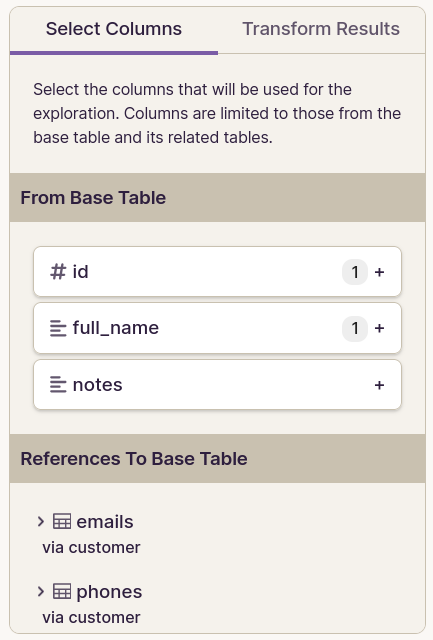
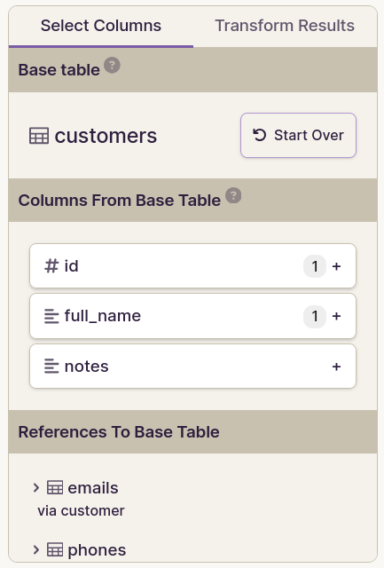

# Exploration Display Improvements

The goal of this spec is to prepare the data explorer for DML capabilities by first making some changes to the way it _displays_ data. These changes are necessary to support DML in terms of UX. We'll make them first so that we can ship them independently of DML if possible (for faster release).

The requirements within this this spec follow a general pattern of trying to **make the data explorer behave more the table page**.

## Front end changes

### Render all cells as read-only

On the table page, when a cell is read-only, it gets a gray background.

Since all data explorer cells are currently read-only, they should appear the same way read-only table page cells appear.

### Add record page hyperlinks to PK cells

On the table page, PK cells currently get a hyperlink to a record page.

We should do the same in the data explorer.

Note that an exploration might contain multiple PK cells (for different tables).

### Add a context menu on all data cells

Every data cell should have a context menu containing the following options:

- Set to null (will always be disabled, until DML is possible)
- Open linked record page (when in FK column)

There should not be a context menu on row header cells or column header cells (for now).

Rationale:

- The purpose for this change is to allow the user to navigate to the record page for linked records, potentially in another tab. This opens up a workflow for DML on linked records.
- Even though most cells will only have a "Set to null" option (which does nothing), we should still add the context menu to all data cells so in order to try (perhaps in vain) to help users discover the "Open linked record page" option on FK cells.
- Note that we'd like to iron this flow out later by providing the option to open/edit a linked record in a modal, but it's not strictly necessary right now. And when we make that improvement later on, we can make it such that it applies to all FK cells (in the table page _and_ data explorer).

### Establish a means to persist column display options inside explorations

Several other requirements described within this spec involve storing column display options inside an exploration. Since explorations do not currently have any persistent display options, storing them will require a new data structure.

#### Considerations

- In the table page, column display options are associated with column _attnums_. But we can't do that in explorations because one table column can occur multiple times, and some result column won't correspond to particular table column at all.

- In the data explorer, columns can be renamed, removed, and (eventually) rearranged. Ideally we'd like a mechanism to persist column display options which is resilient against such changes to the query definition.

#### How column display options will be stored

- We'll store display options within the `display_options` JSON field that already exists on the `Explorations` model. (We've not used that field thus far, but it appears to be exposed to the API already, so no backend changes would be necessary here.)

- Display options will reference result columns using **multiple attributes**.

- Here is an example `display_options` JSON value which would store display options for two result columns:

    <details>
    <summary>Example <tt>display_options</tt> value:</summary>

    ```json5
    {
      "2": { // 👈 result column index (zero-based)
        "result_column": {
          "name": "date_of_birth", // 👈 result column name
          "index": 2,
          "type": {
            "name": "timestamp with time zone"
          }
        },
        "display_options": {
          "date_format": "us",
          "time_format": "12hr"
        }
      },
      "5": {
        "result_column": {
          "name": "emails",
          "index": 5,
          "type": {
            "name": "_array",
            "item_type": {
              "name": "bigint"
            }
          }
        },
        "display_options": {
          "width": 250
        }
      }
    }
    ```

    </details>

- The front end will have a reconciliation process which runs every time the query runs.

-  The reconciliation process will look at each display options entry and do its best to find a matching entry in the list of result columns. The presence of multiple column attributes will help the reconciliation algorithm maintain resilience against various small mutations to the result set such as renamed and re-arranged columns.

- The reconciliation process will produce a _corrected_ `display_options` mapping in the event that something has changed within the query or the DB.

- If the corrected display options differ from the stored display options, the front end will update its stored display options. If the exploration is unsaved, those updated display options will continue to persist only in the browser memory. But if the exploration is saved in the internal database, then the front end will _silently_ update the saved exploration in the internal database. The user won't see any unsaved changes or notice that the saved exploration has been updated.

### Persist column widths

Save column widths inside the exploration.

Rationale:

- Of course this is helpful for users, but it's not strictly necessary as a path to DML in explorations. This feature is specified as a requirement because I think it will actually also help us to test out our column display option persistence mechanism because it's the only display option that should be possible for _all_ column types. Plus, it's possible to change column width even not sidebars are visible. It serves as a nice stress test for technical and UX concerns regarding column display options.

### Offer type-specific column display options

The "Column" tab of the exploration inspector should have a "Formatting" section just like the table page. Those formatting settings should get stored as column display options.

### Change "Delete Column" button

As we add more data-modification capabilities to the data explorer, the "Delete Column" button might become confusing. We should change its label to:

> Remove Column From Query

### Remove Undo/Redo functionality

Yes, this reduces functionality. But I think it's worth it.

I think that where users would _really_ like to have undo is for DML changes. I don't think undo is particularly useful for changes to the exploration definition, but once we have DML capabilities the "undo" button could be a source of confusion. I really want to avoid a situation where users think they can undo DML changes but actually they can't.

Without undo, we'd still need to keep track of the current exploration definition separately from the last-saved exploration definition. Those two versions would be the only relevant states to maintain.

### Make "Query" panel collapsible

Currently the right "Inspector" panel is collapsible via an "Inspector" button in the top toolbar.

We should make the left "Query" panel collapsible too, via a "Query" button in the top toolbar.

- The state of the panel visibility would persist only in browser memory. (It would not be saved to local storage or to the exploration definition.)
- When the exploration page is loaded, the initial panel visibility would be determined as follows:
    - If the page is loading a _saved_ exploration, then the panel would be **hidden**.
    - Otherwise (i.e. for a _new_ exploration), then panel would be **visible**.

### Use a dynamic active state for the "Inspector" button

Currently the table page changes the appearance of the "Inspector" button based on the visibility of the table inspector. We should do the same in the data explorer, and do it for the new "Query" button as well.

### Move base table UI into left sidebar

The base table selection UI is currently in the top toolbar. It should be moved into the left (Query) sidebar as shown in the mockups below. This includes the "Start Over" button too.

When a user is starting a new exploration from scratch, we'll need to improvise where to put the base table UI.

### Improve inspector section headings

- Make the section headings in the inspector look the same way the do in the table page.
- Store the section heading visibility state in localStorage the same way we do for the table page.

Since the "Column" tab will be getting more sections, these changes will make it easier for users to navigate the sections.

### Merge routes

Currently, we have two separate routes for "viewing" and "editing" an exploration. These should get merged into one page — the "Exploration Page".

The current exploration "editing" page will become the new "exploration page", but it will be available at the route currently used for the "viewing" page. This means users will not see "edit" within the URL or within the top nav bar.

Rationale:

- This consolidation simplifies the experience for users
- It also simplifies the design and code considerations for developers, which is important because we'll be iterating a _lot_ on the data explorer to eventually bring it into feature parity with the table page.

### Change the UX for saving changes to the exploration definition

Currently:

- The data explorer shows a yellow "Unsaved Changes" indicator when viewing a saved exploration that has been modified.
- It also shows a green "All Changes Saved" indicator after saving an exploration.

When DML becomes possible in explorations, this UX might become confusing to users

Going forward, the "save status" should be collapsed into the "Save" button.

The "Save" button should behave as follows:

- It should not have a dropdown menu anymore. (The "Merge routes" requirement means we don't need it.)
- It should have a more normal background color (not red).
- It should have a save icon (i.e. floppy disk).
- When there are unsaved changes:
    - The button should have a red dot to indicate unsaved changes. The dot can be applied to the button or to the label. We can improvise this during implementation to see what looks best.
    - The button should have a tooltip:

        > This exploration definition has unsaved changes

- While saving
    - the button should be disabled
    - The icon should become a loading spinner

- When saved:
    - The button should be disabled
    - the button should not have a red dot or tooltip


## Mockups

### Top toolbar

This shows the state of the toolbar for a saved exploration that has unsaved changes.

- Current

    

- Proposed

    

Changes:

- Base table is removed
- "Unsaved changes" is collapsed into a red dot
- Undo/redo is removed
- Inspector button has a dynamic active state
- Save button no longer has a dropdown menu
- Query toggle button is added

### Query sidebar

| Current | Proposed |
| -- | -- |
|  |  |

Changes:

- The Base table and "Start over" button are added here

## Backend changes

### `explorations.run`

#### Return value

- Within `column_metadata` we need the following new properties added to each column metadata blob:
    - `primary_key`
        - When the underlying table column has a single-column primary key constraint, the value here should be `true`.
        - This is to support the "record page hyperlink" feature.

### `explorations.run_saved`

Remove this API method.

- We only use this on the exploration "viewing" page, which we're removing.

