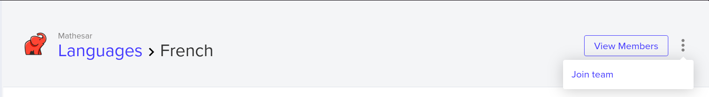

# Translator Guide

Welcome! This guide is for contributors who want to help translate Mathesar into different languages. Whether you're an experienced translator or new to the process, this document outlines everything you need to get started.

## Translating Mathesar

Mathesar uses [Transifex](https://explore.transifex.com/mathesar/mathesar/) to manage all translations. It’s an online localization platform that allows our global community to collaboratively translate Mathesar into multiple languages.

The [Mathesar Transifex project](https://explore.transifex.com/mathesar/mathesar/) lists all available languages, shows the percentage completed for each one, and provides tools for contributing directly through your browser.

## Getting Started

### 1. Create a Transifex Account

Go to [transifex.com](https://www.transifex.com/) and sign up for a free account if you don’t have one. You can also log in with an existing GitHub account.

### 2. Join the Mathesar Project

1. Visit the [Mathesar project on Transifex](https://explore.transifex.com/mathesar/mathesar/).
1. Click the "Join this Project" button.
1. Select your preferred language(s) or request to add a new one.
1. After selecting your language(s), a Mathesar maintainer will manually approve your request to join. This can take up to 24 hours.

Once approved, you can start translating right away!

!!! info "Translating additional languages"
      If you're already a member of the Mathesar translation team, the process to translate _additional_ languages beyond the ones you chose at sign-up can be confusing.

      You must first select an _existing_ language from the Mathesar project, then click the "view resources" button. Finally, on the next page, click the "falafel" (three vertical dots) menu and choose "Join team", like so:

      

## Translating Mathesar in Transifex

On the [Mathesar project](https://explore.transifex.com/mathesar/mathesar/) you'll see the list of avaliable languages. Hover over your desired language and then hit the "Translate" button to get started.

You'll see two resources avaliable for translation in each language:

- The `django.po` includes strings for Mathesar's backend and actions related to logging in and out, pasword resets, etc.
- The `dict.json` file includes the vast majority of strings needing translation.

Clicking on each resource will allow you to translate individual pieces of text in Mathesar. Be sure to press the "Save" button after making your suggested translations, and a member of the Mathesar team will approve the work.

### Best Practices for translation

* **Translate meaning, not just words.**
  Focus on clarity and natural phrasing for your audience.
* **Preserve placeholders and variables.**
  Texts like `{username}` or `[text]` must remain unchanged within strings. These are dynamic values, for example the name of a database or the count of returned rows on a table page.
* **Check for existing terminology.**
  Reuse terms from the glossary or previously translated strings to maintain consistency.
* **Ask if unsure.**
  Use the Transifex comment threads or reach out on our community channels if a string is unclear.

---

## Need Help?

For translation questions, reach out to the Mathesar team via:

* [The i18n channel on Mathesar's Matrix chat](https://matrix.to/#/#i18n:matrix.mathesar.org)
* Transifex comments (on specific strings)

Thank you! 🐘
