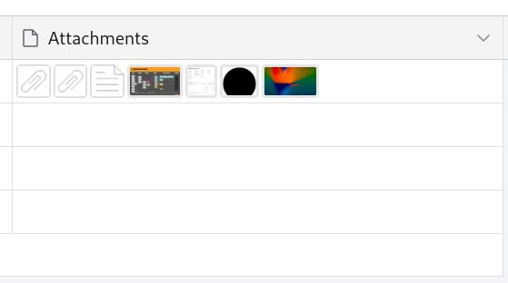
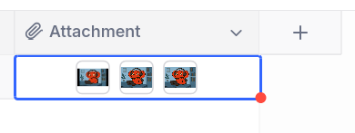

# File Attachments

!!! success "Approved, see [project](../../proposals/2025/file-attachments.md)."

## The Problem

Users need to associate files with individual records in their tables, and they prefer to add, view, and remove these files in context with their associated data. They need to determine which records do or do not have required files. Without built-in file support, users are forced to rely on third-party tools and fragmented workflows.

### Is it feasible?

File attachments is a constrained, standalone feature that exists in all of the spreadsheet-like products in Mathesar's ecosystem. File attachments are extremely common in _most_ web-based software, as such there are considerable resources, libraries, and references to facilitate the work on this feature. It is very feasible to implement.

## Use Cases

As the owner of a construction company, I want to:

- Associate screenshots of signed contracts with each construction job, so I know which jobs can have their status updated to “Approved”.
- Make sure staff members who can access our main jobs table are able to view the associated contracts, order sheets, and permits for each job, without needing access to any other system.
- Attach inspection reports, permits, and compliance documents to jobs, so my team and I can produce reports about non-compliant jobs.
- Find a construction job using its job ID number, so I can immediately access and print the signed contract.
- Check that "Approved" jobs have the required documents, an approved contract and a paid invoice, so that work can begin as quickly as possible.
- Remove files that have accidentally been added to the wrong job, so that the correct materials are ordered for each job.

## Requirements

- Add one or multiple file attachments of any type to records
- Remove file attachments previously associated with records
- Find specific records based on attachment(s) information

## Ecosystem Analysis

There are many existing examples of this functionality in other applications, so there is a lot of inspiration to draw from.

### Airtable

Airtable offers an “Attachments” column type which is described as "Add images, documents, or other files to be viewed or downloaded."

### Baserow

Baserow has a “File” column type with similar behavior:

### NocoDB

NocoDB has an “Attachments” column type with very similar behavior:

