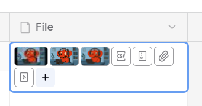

# File Attachments

## The Problem

Users need to associate files with individual records in their tables, and they prefer to add, view, and remove these files in context with their associated data. They need to determine which records do or do not have required files. Without built-in file support, users are forced to rely on third-party tools and fragmented workflows.

### Is it feasible?

File attachments is a constrained, standalone feature that exists in all of the spreadsheet-like products in Mathesar's ecosystem. File attachments are extremely common in _most_ web-based software, as such there are considerable resources, libraries, and references to facilitate the work on this feature. It is very feasible to implement.

## Use Case - Invoice & Proof Management

As a business operations manager handling invoices, I want to:

* Attach photographic "proofs" to each invoice—images that clearly show SKUs and product names for every line item.
* Add multiple documents (e.g., purchase orders, signed contracts) that support or validate the invoice.
* Upload files to invoice records at any point during the approval and fulfillment process.
* Quickly browse all photographic proofs in medium-size thumbnails without needing to open each one.
* Open and inspect product proofs or contract PDFs in full resolution for detailed review.
* Download any file associated with an invoice for sharing or printing.
* Identify which invoices are still missing required attachments (e.g., signed contract or PO).
* Efficiently handle 10–200 files per invoice record without performance issues.
* Perform data edits alongside file uploads as part of the same user interaction.

## Requirements

* Add **one or multiple** file attachments (images or PDFs) to a record.
* Upload new files to a record at any time.
* Remove files associated with a record.
* Download individual files.
* View attachment thumbnails for **quick visual scan** (especially for images).
* View attachments in **full resolution** (image or PDF, in-browser acceptable).
* Maintain **fast loading times** when displaying many files in a single view.
* Allow users to distinguish whether a file field is populated or empty (e.g., for required uploads).

### Optional / Deferred Features

These are valuable but not required for the initial version:

* Upload new files to a record easily on mobile.
* Display medium-size previews for **PDFs** (not just download links or filenames).
* Display **EXIF data** for images (can be accessed after downloading for now).

## Ecosystem Analysis

There are many existing examples of this functionality in other applications, so there is a lot of inspiration to draw from.

### Airtable

Airtable offers an “Attachments” column type which is described as "Add images, documents, or other files to be viewed or downloaded."

### Baserow

Baserow has a “File” column type with similar behavior:

### NocoDB

NocoDB has an “Attachments” column type with very similar behavior:

