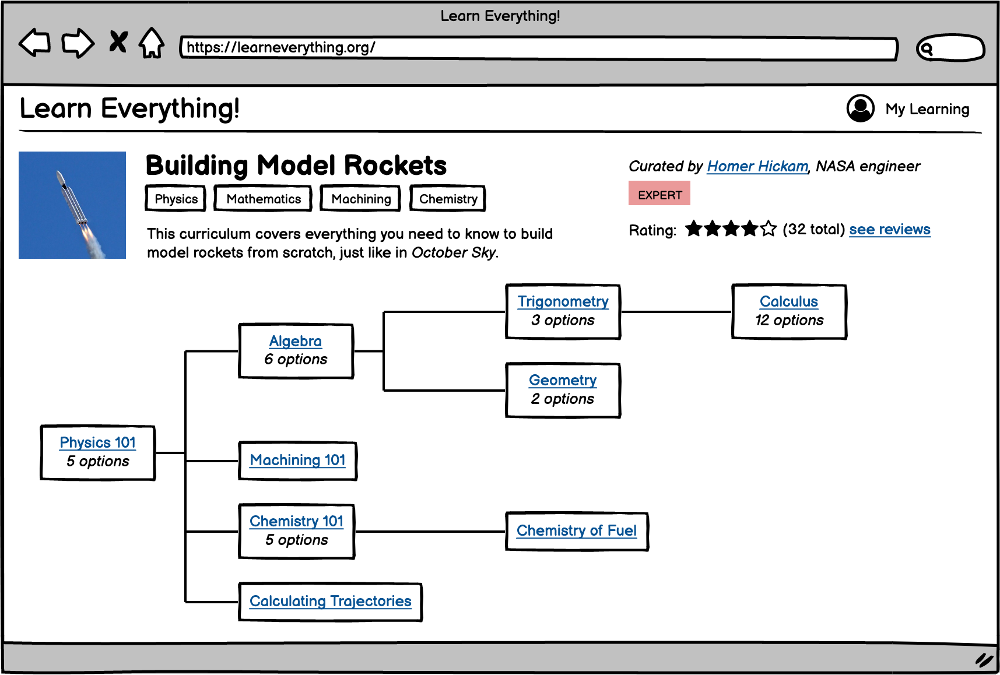

Related goal: [Accelerate knowledge, creativity, and innovation in the world](accelerate-innovation)

## Problem
Learning new things is harder than it could be:
- There's no good way to find diffferent learning resources related to a specific topic
- Most educational websites produce their own content and do not aggregate content
- Some people learn better from videos, others learn better from books
- Many learning resources online closely approximate existing school or college curricula, although there may be better ways to learn.
- It's difficult for people to know exactly what they need to learn to get to a specific goal. For example, someone's goal might be to learn what it takes to build their own model rocket or to have a thorough understanding of Asian history. Motivated people will find what they need to get to these goals, but making it really easy to learn might encourage more laypeople to spend more time learning.

## Solution
A new system for personalized learning that:
- indexes learning resources, both online and offline.
- categorizes resources according to topic, and marks resources that cover the same content.
  - for example, "Physics 101" could show textbooks, video lectures, MOOCs, Khan Academy courses, etc. as equivalent; the user could pick the one that works best for them.
- allows people to create custom curricula aimed at a particular goal (e.g. launching a model rocket, learning Asian history)
- allows people to follow and track their progress on specific curricula

The "aim for the stars" long term vision for the product would be to replace universities and schools with fixed curricula with an experience that allows people to follow their interests and learn whatever they choose.

### UI Mockups
Here are some very rough UI mockups to illustrate the idea behind the project.

**Homepage**: This shows different ways of exploring educational content – by search, by topic, and by featured curriculum. It also has the option for users to make their own curriculum.

**Curricula Search**: This shows search results for curricula that users have put together. "fly a rocket" shows two results – a course on building a rocket, and a course on the history of rocketry. Curators can be "experts" in the field (mechanic for determining this is TBD)

**Curriculum Detail**: This shows the detail page for a single curriculum. It shows a description, reviews, etc., but also shows a map of modules that are part of the curriculum.

**Module Detail**: This shows the detail page for a single module. It shows different ways you can learn the material, and some metadata about it. It allows the user to suggest additional alternatives to learn the material, and also shows some related short material in the sidebar.

**My Learning**: This page shows how the user can track their own learning.

## Feasability
It should be pretty easy to get to a MVP of this project, there's not a lot of technical complexity.

The main problems that we'll need to solve to make this scale are:
- Finding a good data model for what should be a module, what should be a curriculum, etc.
- Figuring out how to make good automatic guesses for categorizing modules
- Building a community of experts and users to curate curricula

We also need to figure out if we want to provide alternatives below the module level e.g. for single lectures of video courses or single chapters of books.

It would be neat to figure out how to build this in a federated way so that people can host their own copies of the software but the community and curation could be global.

### Potential Roadmap
- Start by creating an MVP with a few sources ingested and a few curricula pre-created.
- Expand sources and curricula based on user needs; recruit experts to the community.
- Eventually, we could expand into testing and certification (e.g. let people learn physics however they want and offer a physics test and certification, then offer certifications for entire curricula)

### Potential Users
- I'm not sure where to start recruiting users for this project.

## Sustainability
- We could use affiliate marketing to raise money (e.g. links to paid services earn us money, or links to Amazon etc.)
- Eventually, we could offer testing and certifications.
- We could also host ticketed events with experts.
- Paid subscriptions for advanced features could also work.

## Challenges

### Questions
- Can we make learning compelling enough for users who would spend time doing other things to instead spend time learning?
- Are there things that existing services (nonprofits like Khan Academy or for-profits like Coursera or Skillshare) aren't doing well that we could do better?
- Is curation of open resources a problem that needs solving?
- Are there enough open resources out there to make this viable?
- Could we build up a strong enough community that could curate resources in multiple domains?

### Competitors

- [Learnamic](https://www.learnamic.com/) allows searching for educational resources across hundreds of websites and filtering by type.
- [Lesson Planet](https://www.lessonplanet.com/) and [Learning Explorer](https://www.learningexplorer.com/) - curriculum planning for teachers
- [CK-12](https://www.ck12.org/student/), personalized learning

## Additional Thoughts

### Networks and Communities

Motivation to learn often comes once you have a goal, but a lot of learning environments is about finding goals and motivation. There is a well developed idea that learning is a social construct and that you start by "hanging out" then "messing around" and then "geeking out." The key is to find a community and an affinity and a network. [Hanging Out, Messing Around, and Geeking Out](https://mitpress.mit.edu/books/hanging-out-messing-around-and-geeking-out)is a book about this.

### Personal Knowledge Management

There is a rich field of Personal Knowledge Management (PKM) which appears to be having a resurgance in interst. It's open source friendly and has a community with a rich set of tools.
